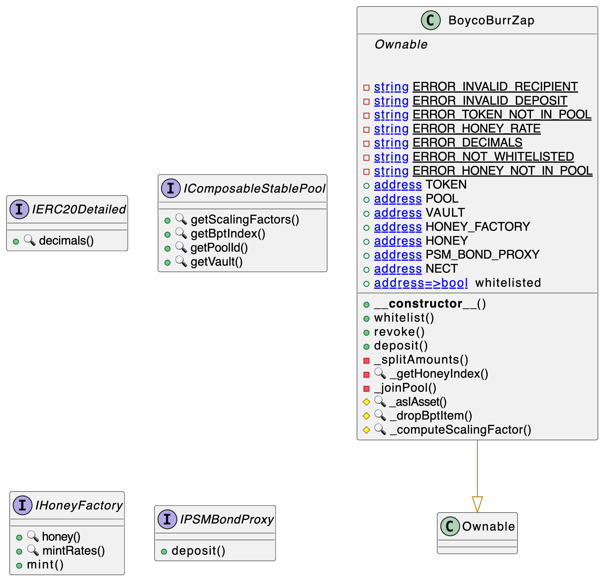

<div id="splash">
    <div id="project">
          <span class="splash-title">
               Project
          </span>
          <br />
          <span id="project-value">
               BoycoBurrZap
          </span>
    </div>
     <div id="details">
          <div id="left">
               <span class="splash-title">
                    Client
               </span>
               <br />
               <span class="details-value">
                    Burrbear
               </span>
               <br />
               <span class="splash-title">
                    Date
               </span>
               <br />
               <span class="details-value">
                    December 2024
               </span>
          </div>
          <div id="right">
               <span class="splash-title">
                    Reviewers
               </span>
               <br />
               <span class="details-value">
                    Daniel Luca
               </span><br />
               <span class="contact">@cleanunicorn</span>
          </div>
    </div>
</div>


## Table of Contents
 - [Details](#details)
 - [Issues Summary](#issues-summary)
 - [Executive summary](#executive-summary)
     - [Project handover](#project-handover)
     - [Day 1](#day-1)
     - [Review handover](#review-handover)
 - [Scope](#scope)
 - [Recommendations](#recommendations)
 - [Issues](#issues)
     - [deposit() function vulnerable to sandwich attacks](#deposit-function-vulnerable-to-sandwich-attacks)
     - [Add array length validation in _splitAmounts](#add-array-length-validation-in-_splitamounts)
     - [Return variables not checked from transferFrom](#return-variables-not-checked-from-transferfrom)
     - [Strengthen pool token validation in BoycoBurrZap constructor](#strengthen-pool-token-validation-in-boycoburrzap-constructor)
     - [Add validation for tokenIndex in _splitAmounts](#add-validation-for-tokenindex-in-_splitamounts)
     - [Add token/ETH recovery methods to BoycoBurrZap](#add-tokeneth-recovery-methods-to-boycoburrzap)
     - [Move interfaces from BoycoBurrZap.sol to dedicated interface files](#move-interfaces-from-boycoburrzapsol-to-dedicated-interface-files)
     - [Standardize error message handling](#standardize-error-message-handling)
 - [Artifacts](#artifacts)
     - [Surya](#surya)
     - [Coverage](#coverage)
     - [Tests](#tests)
 - [License](#license)


<div class="pagebreak"></div>

## Details

- **Client** Burrbear
- **Date** December 2024
- **Lead reviewer** Daniel Luca ([@cleanunicorn](https://twitter.com/cleanunicorn))
- **Reviewers** Daniel Luca ([@cleanunicorn](https://twitter.com/cleanunicorn))
- **Repository**: [BoycoBurrZap](https://github.com/burrbear-dev/boyco-flow)
- **Commit hash** `5895710ebabc0cb1b370b0414e17980d93f1c27c`
- **Technologies**
  - Solidity

## Issues Summary

  <p align="center">
      
  </p>

| SEVERITY       |    OPEN    |    CLOSED    |
|----------------|:----------:|:------------:|
|  Informational  |  0  |  2  |
|  Minor  |  0  |  2  |
|  Medium  |  0  |  3  |
|  Major  |  0  |  1  |

## Executive summary

This report represents the results of the engagement with **Burrbear** to review **BoycoBurrZap**.

The review was conducted over the course of **1 day** during **December 29, 2024**. A total of **1 person-days** were spent reviewing the code.

### Project handover

I spent an approximate of 2 hours reviewing the current state of the project and the codebase. I identified a few small issues that would help create a more defensive codebase.

Additionally we discussed some assumptions about the deposit mechanics, specifically if the deposit is sandwitched between transactions that would imbalance the pool substantially.

This time was critical because it allowed us to understand the project and the codebase before starting the review.

### Day 1

I spent the first day reviewing the codebase and the project. I focused on manually reviewing the codebase, searching for security issues such as, but not limited to, re-entrancy problems, transaction ordering, block timestamp dependency, exception handling, call stack depth limitation, integer overflow/underflow, self-destructible contracts, unsecured balance, use of origin, costly gas patterns, architectural problems, code readability.

In parallel, I checked the Balancer V2 implementation to see if it matches the codebase.

### Review handover

We discussed any open questions and issues we found during the review. Each issue that required a change was fixed in a separate commit. Other issues were acknowledged and don't require any code changes.

## Scope

The initial review focused on the [BoycoBurrZap](https://github.com/burrbear-dev/boyco-flow) repository, identified by the commit hash `5895710ebabc0cb1b370b0414e17980d93f1c27c`.

I focused on manually reviewing the codebase, searching for security issues such as, but not limited to, re-entrancy problems, transaction ordering, block timestamp dependency, exception handling, call stack depth limitation, integer overflow/underflow, self-destructible contracts, unsecured balance, use of origin, costly gas patterns, architectural problems, code readability.

**Includes:**
- BoycoBurrZap.sol

**Auxiliary but not included:**
- BoycoBurrZap.t.sol

## Recommendations

I identified a few possible general improvements that are not security issues during the review, which will bring value to the developers and the community reviewing and using the product.

## Issues


### [`deposit()` function vulnerable to sandwich attacks](https://github.com/akiratechhq/review-burrbear-boyco-2024-12/issues/8)
 

**Description**
The `deposit()` function in BoycoBurrZap.sol is vulnerable to sandwich attacks due to its reliance on current pool balances to determine deposit ratios. An attacker can manipulate the pool's balance immediately before and after the victim's deposit transaction to profit from the imbalanced state.

Attack flow:
1. Attacker observes pending deposit transaction
2. Attacker executes "front-running" transaction to imbalance pool ratios
3. Victim's deposit executes using manipulated ratios
4. Attacker executes "back-running" transaction to restore pool balance and extract profit

The vulnerability exists because:
- Pool ratios are queried at transaction execution time
- No slippage protection is implemented
- No minimum output amount is specified in the joinPool call
- No timelock or other MEV protection mechanisms are in place

**Recommendation**
Several measures can be implemented to mitigate this risk:

1. Add slippage protection:
   - Allow users to specify minimum BPT output
   - Implement maximum deviation checks for pool ratios

2. Use time-weighted average prices (TWAP) instead of spot prices

3. Add deadline parameter to prevent transaction from sitting in mempool

4. Consider implementing commit-reveal scheme for deposits

Example code modification:
```solidity
function deposit(
    uint256 _depositAmount, 
    address _recipient,
    uint256 _minBPTOut,
    uint256 _deadline
) public onlyWhitelisted {
    require(block.timestamp <= _deadline, "Transaction expired");
    // ... existing code ...
    
    // Modify _joinPool to use minimum BPT out
    _joinPool(poolId, tokens, amountsIn, bptIndex, _recipient, _minBPTOut);
}
```


---


### [Add array length validation in `_splitAmounts`](https://github.com/akiratechhq/review-burrbear-boyco-2024-12/issues/4)
 

**Description**
The `_splitAmounts` function in BoycoBurrZap.sol takes a `MintParams` struct containing three arrays: `tokens`, `balances`, and `scalingFactors`. Currently, the function assumes these arrays have matching lengths but doesn't explicitly validate this assumption.

If these arrays have mismatched lengths, it could lead to:
1. Array index out of bounds errors
2. Incorrect calculations
3. Potential security vulnerabilities

**Recommendation**
Add input validation at the start of `_splitAmounts` to ensure all arrays have matching lengths:

```solidity:code/src/BoycoBurrZap.sol
function _splitAmounts(MintParams memory params) private returns (uint256[] memory amountsIn) {
    uint256 len = params.balances.length;
    require(
        params.tokens.length == len && params.scalingFactors.length == len,
        "Array lengths must match"
    );
    amountsIn = new uint256[](len);
    // ... rest of the function
}
```

It's unclear if the order and content of (`tokens`, `balances`) versus (`scalingFactors`) should always use the same token order. Checking the Balancer V2 implementation did not create enough certainty.


---


### [Return variables not checked from `transferFrom`](https://github.com/akiratechhq/review-burrbear-boyco-2024-12/issues/2)
 

**Description**
The contract currently uses `transferFrom` to transfer tokens from users to the contract. While this works for most ERC20 tokens, some tokens don't implement the ERC20 standard correctly and may not return a boolean value or may revert.

Because this contract might be used for other tokens, we have to make sure it supports all implementations.

Current implementation in BoycoBurrZap.sol:


[code/src/BoycoBurrZap.sol#L160](https://github.com/akiratechhq/review-xave-boyco-2024-12/blob/aca54de00d73b87aad12d465491fcebf7abaa61a/code/src/BoycoBurrZap.sol#L160)
```solidity
        IERC20(TOKEN).transferFrom(msg.sender, address(this), _depositAmount);
```

Notable examples of non-standard ERC20 implementations:
1. USDT (Tether) - Doesn't return a boolean on transfers
2. BNB (old version) - Didn't return a boolean on transfers
3. ZRX - Required updating to handle both old and new transfer patterns

**Recommendation**
Use OpenZeppelin's `SafeERC20` library which provides `safeTransferFrom`. This wrapper handles non-standard implementations and ensures transfers work correctly across all ERC20 tokens:

```solidity
import {SafeERC20} from "@openzeppelin/contracts/token/ERC20/utils/SafeERC20.sol";

contract BoycoBurrZap is Ownable {
    using SafeERC20 for IERC20;
    
    // ... in deposit function:
    IERC20(TOKEN).safeTransferFrom(msg.sender, address(this), _depositAmount);
}
```

**References**
1. OpenZeppelin SafeERC20: https://github.com/OpenZeppelin/openzeppelin-contracts/blob/master/contracts/token/ERC20/utils/SafeERC20.sol
2. USDT Implementation: https://etherscan.io/token/0xdac17f958d2ee523a2206206994597c13d831ec7#code
3. Navigating the pitfalls of securely interacting with ERC20 tokens: https://soliditydeveloper.com/safe-erc20
4. Missing return value bug — At least 130 tokens affected: https://medium.com/coinmonks/missing-return-value-bug-at-least-130-tokens-affected-d67bf08521ca
5. Why does SafeERC20 assume that the token's transfer and transferFrom return value is optional?: https://ethereum.stackexchange.com/a/137057/6253


---


### [Strengthen pool token validation in `BoycoBurrZap` constructor](https://github.com/akiratechhq/review-burrbear-boyco-2024-12/issues/1)
 

**Description**
The current implementation in `BoycoBurrZap.sol` checks if HONEY, NECT, and the base token are present in the pool, but doesn't verify that these (plus the virtual BPT token) are the only tokens in the pool. If additional unexpected tokens are present, the contract might still initialize successfully, potentially leading to incorrect calculations or unexpected behavior.

Current code only checks for token presence:


[code/src/BoycoBurrZap.sol#L115-L126](https://github.com/akiratechhq/review-xave-boyco-2024-12/blob/aca54de00d73b87aad12d465491fcebf7abaa61a/code/src/BoycoBurrZap.sol#L115-L126)
```solidity
        // ensure all tokens are present in the pool
        bytes32 poolId = IComposableStablePool(_pool).getPoolId();
        (IERC20[] memory tokens,,) = IVault(_vault).getPoolTokens(poolId);
        bool honeyInPool = false;
        bool tokenInPool = false;
        bool nectInPool = false;
        for (uint256 i = 0; i < tokens.length; i++) {
            if (address(tokens[i]) == _honey) honeyInPool = true;
            else if (address(tokens[i]) == _token) tokenInPool = true;
            else if (address(tokens[i]) == _nect) nectInPool = true;
        }
        require(honeyInPool && tokenInPool && nectInPool, ERROR_TOKEN_NOT_IN_POOL);
```

**Recommendation**
Add a check to verify that the pool contains exactly 4 tokens (HONEY, NECT, base token, and the virtual BPT token):

```solidity
require(tokens.length == 4, "Invalid number of pool tokens");
```

This ensures that no unexpected tokens are present in the pool that could affect the zapping calculations or create unforeseen issues.

**References**
- [Balancer ComposableStable Pool documentation](https://balancer.gitbook.io/balancer-v2/products/balancer-pools/composable-stable-pools#what-does-composable-mean) regarding virtual BPT token
- Current implementation in `BoycoBurrZap.sol` constructor


---


### [Add validation for `tokenIndex` in `_splitAmounts`](https://github.com/akiratechhq/review-burrbear-boyco-2024-12/issues/5)
 

**Description**
In the `_splitAmounts` function, `tokenIndex` is initialized to 0 and only set when the token is found in the loop. However, there's no validation to ensure the token was actually found. If the token isn't found (which shouldn't happen due to constructor checks, but is still a potential issue), the function would continue using the default value of 0, which could lead to incorrect calculations or unexpected behavior.

Current code:
```solidity
uint256 tokenIndex = 0;  // initialized but not validated
// ... loop that sets tokenIndex ...
// tokenIndex is used later without validation
amountsIn[tokenIndex] = IERC20(TOKEN).balanceOf(address(this));
```

**Recommendation**
Add validation after the loop to ensure `tokenIndex` was properly set. This could be done by either:

1. Adding a boolean flag:
```solidity
bool foundToken = false;
uint256 tokenIndex = 0;
for (uint256 i = 0; i < len; i++) {
    if (address(params.tokens[i]) == TOKEN) {
        tokenIndex = i;
        foundToken = true;
    }
    // ... rest of loop ...
}
require(foundToken, "Token not found in pool");
```

2. Or using a similar pattern to `_getHoneyIndex`:
```solidity
function _getTokenIndex(IERC20[] memory tokens) private view returns (uint256) {
    for (uint256 i = 0; i < tokens.length; i++) {
        if (address(tokens[i]) == TOKEN) {
            return i;
        }
    }
    require(false, "Token not found in pool");
    return 0;
}
```

**References**
- Similar validation is already implemented for HONEY token in the `_getHoneyIndex` function


---


### [Add token/ETH recovery methods to BoycoBurrZap](https://github.com/akiratechhq/review-burrbear-boyco-2024-12/issues/3)
 

**Description**
The `BoycoBurrZap` contract currently has no way to recover tokens or ETH that might accidentally get sent to it. While the contract is designed to immediately use any deposited tokens in the happy path, Royco might accidentally send tokens or ETH directly to the contract address.

We should add recovery methods that allow the contract owner to withdraw any tokens (including the managed tokens) or ETH that gets stuck in the contract. This is safe because:
1. In normal operation, the contract should never hold any tokens - they are immediately deposited in the pool
2. Only accidentally sent funds would remain in the contract
3. The contract is not designed to be a custody solution

**Recommendation**
Add the following methods to the contract:

```solidity:code/src/BoycoBurrZap.sol
function recoverERC20(address token, address recipient, uint256 amount) external onlyOwner {
    IERC20(token).transfer(recipient, amount);
    emit RecoveredERC20(token, recipient, amount);
}

function recoverETH(address recipient, uint256 amount) external onlyOwner {
    (bool success,) = recipient.call{value: amount}("");
    require(success, "ETH transfer failed");
    emit RecoveredETH(recipient, amount);
}
```

Also add the corresponding events:
```solidity
event RecoveredERC20(address indexed token, address indexed recipient, uint256 amount);
event RecoveredETH(address indexed recipient, uint256 amount);
```


---


### [Move interfaces from BoycoBurrZap.sol to dedicated interface files](https://github.com/akiratechhq/review-burrbear-boyco-2024-12/issues/7)
 

**Description**
Currently, the `BoycoBurrZap.sol` contract contains several interfaces at the bottom of the file:
- `IERC20Detailed`
- `IComposableStablePool`
- `IHoneyFactory`
- `IPSMBondProxy`

These interfaces should be moved to dedicated files in an `interfaces` directory for better code organization, maintainability, and reusability.

**Recommendation**
1. Create a new `interfaces` directory under `src`
2. Create separate files for each interface:
   - `interfaces/IERC20Detailed.sol`
   - `interfaces/IComposableStablePool.sol`
   - `interfaces/IHoneyFactory.sol`
   - `interfaces/IPSMBondProxy.sol`
3. Move each interface to its respective file
4. Update imports in `BoycoBurrZap.sol` to reference the new interface locations

This change will:
- Improve code organization and maintainability
- Make interfaces more discoverable
- Enable reuse of interfaces across multiple contracts
- Follow common Solidity project structure conventions


---


### [Standardize error message handling](https://github.com/akiratechhq/review-burrbear-boyco-2024-12/issues/6)
 

**Description**
Currently, the contract has inconsistent error handling. Most errors are defined as constant strings at the top of the contract, but some error messages are directly written in the require statements. For example:

```solidity
// Current approach - Mixed styles
// Style 1: Using constants
string private constant ERROR_INVALID_RECIPIENT = "Invalid recipient";
require(_recipient != address(0), ERROR_INVALID_RECIPIENT);

// Style 2: Direct strings
require(tokenDecimals <= 18, "Token decimals must be <= 18");
```

This inconsistency makes error handling harder to maintain and update. It also makes it more difficult to ensure error message consistency across the codebase.

**Recommendation**
1. Move all error messages to constants at the top of the contract
2. Use these constants in all require statements
3. Follow the existing naming convention of `ERROR_*` for all error constants

Example implementation:
```solidity
// Add to existing error constants
string private constant ERROR_INVALID_DECIMALS = "Token decimals must be <= 18";

// Update the require statement
require(tokenDecimals <= 18, ERROR_INVALID_DECIMALS);
```

This change will:
- Make error messages more maintainable
- Ensure consistency across the codebase
- Reduce the risk of typos in error messages
- Make it easier to update error messages in the future
- Potentially save gas by reusing constant strings


---


## Artifacts

### Surya

Sūrya is a utility tool for smart contract systems. It provides a number of visual outputs and information about the structure of smart contracts. It also supports querying the function call graph in multiple ways to aid in the manual inspection and control flow analysis of contracts.

#### Graphs

***BoycoBurrZap***

#### Graph

```text
surya graph BoycoBurrZap.sol | dot -Tpng > ./static/BoycoBurrZap_graph.png
```


#### Inheritance

```text
surya inheritance BoycoBurrZap.sol | dot -Tpng > ./static/BoycoBurrZap_inheritance.png
```


#### UML Diagram



#### Describe

```text
➜ surya describe code/src/BoycoBurrZap.sol 
 +  BoycoBurrZap (Ownable)
    - [Pub] <Constructor> #
       - modifiers: Ownable
    - [Pub] whitelist #
       - modifiers: onlyOwner
    - [Pub] revoke #
       - modifiers: onlyOwner
    - [Pub] deposit #
       - modifiers: onlyWhitelisted
    - [Prv] _splitAmounts #
    - [Prv] _getHoneyIndex
    - [Prv] _joinPool #
    - [Int] _asIAsset
    - [Int] _dropBptItem
    - [Int] _computeScalingFactor

 + [Int] IERC20Detailed 
    - [Ext] decimals

 + [Int] IComposableStablePool 
    - [Ext] getScalingFactors
    - [Ext] getBptIndex
    - [Ext] getPoolId
    - [Ext] getVault

 + [Int] IHoneyFactory 
    - [Ext] honey
    - [Ext] mintRates
    - [Ext] mint #

 + [Int] IPSMBondProxy 
    - [Ext] deposit #
```

### Coverage

```text
$ forge coverage
```

### Tests

```text
➜ forge test
[⠊] Compiling...
No files changed, compilation skipped

Ran 8 tests for test/BoycoBurrZap.t.sol:BoycoBurrZapTest
[PASS] test_Fuzz_create_pool_and_deposit(uint256) (runs: 2048, μ: 8172259, ~: 8172260)
[PASS] test_Fuzz_deposit(uint256) (runs: 2048, μ: 895249, ~: 903654)
[PASS] test_Fuzz_deposit_max(uint256) (runs: 2048, μ: 903916, ~: 903916)
[PASS] test_deposit_0() (gas: 11462)
[PASS] test_deposit_max() (gas: 682393)
[PASS] test_pool_ratio_loop_deposit() (gas: 17207952)
[PASS] test_small_deposits() (gas: 325049051)
[PASS] test_whitelisted() (gas: 67170)
Suite result: ok. 8 passed; 0 failed; 0 skipped; finished in 15.49s (39.84s CPU time)

Ran 1 test suite in 15.49s (15.49s CPU time): 8 tests passed, 0 failed, 0 skipped (8 total tests)
```

## License

This report falls under the terms described in the included [LICENSE](./LICENSE).

<!-- Load highlight.js -->
<link rel="stylesheet"
href="//cdnjs.cloudflare.com/ajax/libs/highlight.js/10.4.1/styles/default.min.css">
<script src="//cdnjs.cloudflare.com/ajax/libs/highlight.js/10.4.1/highlight.min.js"></script>
<script>hljs.initHighlightingOnLoad();</script>
<script type="text/javascript" src="https://cdn.jsdelivr.net/npm/highlightjs-solidity@1.0.20/solidity.min.js"></script>
<script type="text/javascript">
    hljs.registerLanguage('solidity', window.hljsDefineSolidity);
    hljs.initHighlightingOnLoad();
</script>
<link rel="stylesheet" href="./style/print.css"/>
